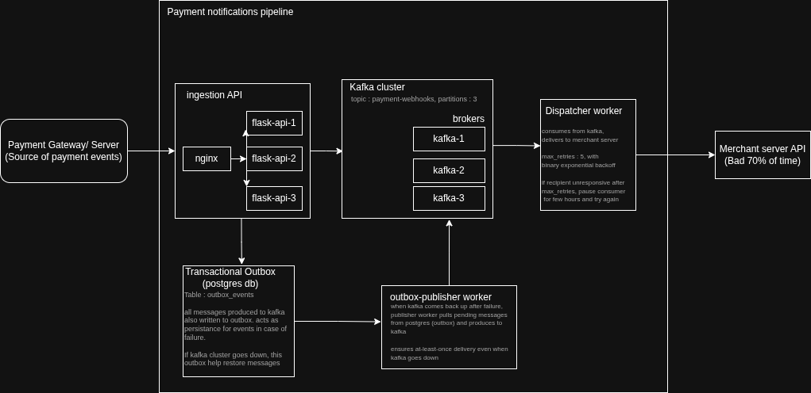

# Bruce

A notification engine for a Fintech platform: when a payment occurs, the system sends an HTTP webhook to a merchant’s server with **at-least-once delivery** guarantees, even when the merchant server is unreliable (timeouts, 500s, long outages).

---

## Components

| Component | Implementation |
|-------------|----------------|
| **Ingestion API** | `POST /events` accepts payment payloads (Flask API behind nginx). |
| **Kafka Cluster** | 3-broker KRaft-mode cluster providing durable message queueing with replication factor 3. |
| **Dispatcher worker** | Consumes from Kafka and asynchronously delivers payloads to a configurable webhook URL with retries and backoff. |
| **Merchant server (Mock receiver)** | Merchant-server simulates a chaotic destination (configurable failure rate, timeouts) to validate the dispatcher. |
| **Transactional Outbox** | Postgres-based outbox pattern ensuring no message loss even if Kafka is down or service crashes. |
| **Outbox Publisher** | Background worker polling `outbox_events` table and publishing pending events to Kafka. |

### Kafka Cluster

A **3-broker Kafka cluster** running in **KRaft mode** (no Zookeeper) provides durable message queueing for webhook delivery.

**Configuration:**
- **Brokers:** 3 nodes (kafka1, kafka2, kafka3), each acting as both broker and controller
- **Topic:** `payment-webhooks` with:
  - **3 partitions** for parallel processing
  - **Replication factor 3** (each partition replicated across all 3 brokers)
  - **Min in-sync replicas (ISR):** 2 (ensures availability even if one broker fails)
- **Ports:**
  - **9092 (PLAINTEXT):** Inter-broker communication within Docker network
  - **9093 (CONTROLLER):** Controller quorum traffic for metadata and voting
  - **19092-19094 (EXTERNAL):** Mapped to host for external access (localhost:19092, 19093, 19094)
- **Durability:** 
  - Producer uses `acks='all'` (waits for acknowledgment from all in-sync replicas)
  - Consumer auto-commits offsets for at-least-once delivery guarantees
  - Transaction state log replication factor 3 for transactional operations

**Fault Tolerance:**
- If Kafka brokers are unavailable, components gracefully handle it:
  - **Ingestion API:** Writes only to Postgres/outbox, skips Kafka production
  - **Outbox Publisher:** Waits and retries after poll interval
  - **Dispatcher:** Retries connecting every 10 seconds until Kafka is available

### Transactional Outbox Pattern

The **transactional outbox pattern** ensures messages are never lost, even if the service crashes or Kafka is unavailable.

**How it works:**
1. **Ingestion API** receives a payment event
2. **Single database transaction** writes to two tables atomically:
   - `payments` table: Stores the payment event payload
   - `outbox_events` table: Creates a pending event record with status `'pending'`
3. If Kafka is available, the API also produces directly to Kafka (optimistic path)
4. If Kafka is down or production fails, the event remains in `outbox_events` for later processing

**Outbox Schema (`outbox_events` table):**
- `id`: Auto-incrementing primary key
- `aggregate_id`: Transaction ID (links to payment)
- `event_type`: Event type (e.g., `'payment.received'`)
- `payload`: JSONB payload of the payment event
- `status`: `'pending'` → `'processing'` → `'published'`
- `attempt_count`: Number of retry attempts
- `last_error`: Error message if publishing fails
- `created_at`, `published_at`: Timestamps
- Unique constraint on `(aggregate_id, event_type)` prevents duplicate events

**Benefits:**
- **No message loss:** Even if Kafka is down or the service crashes, events are safely stored in Postgres
- **Transactional consistency:** Payment and outbox event are written atomically
- **Idempotency:** Unique constraint prevents duplicate events for the same transaction
- **Recovery:** Outbox publisher can replay events after service restart or Kafka recovery

### Outbox Publisher

A background worker that polls the `outbox_events` table and publishes pending events to Kafka.

**Operation:**
- **Polling:** Configurable interval (`OUTBOX_POLL_INTERVAL_SEC`, default: 5 seconds)
- **Batch processing:** Claims batches of pending events (configurable `OUTBOX_BATCH_SIZE`, default: 25)
- **Concurrency:** Uses `FOR UPDATE SKIP LOCKED` to allow multiple publisher instances to run concurrently without conflicts
- **State machine:**
  1. Claim rows: `'pending'` → `'processing'` (atomic update)
  2. Produce to Kafka topic (`payment-webhooks`)
  3. On success: `'processing'` → `'published'`, set `published_at`
  4. On failure: `'processing'` → `'pending'`, increment `attempt_count`, store error

**Kafka Connection Handling:**
- **Lazy connection:** Producer is created only when needed
- **Connection verification:** Checks Kafka availability using `list_topics()` before producing
- **Graceful degradation:** If Kafka is unavailable:
  - Logs error and returns `None` from `_get_producer()`
  - Skips publishing for that poll cycle
  - Waits for `OUTBOX_POLL_INTERVAL_SEC` before retrying
  - Does not crash or exit; continues polling indefinitely
- **Connection recovery:** Automatically reconnects when Kafka becomes available

**Configuration:**
- `OUTBOX_POLL_INTERVAL_SEC`: How often to poll for new events (default: 5s)
- `OUTBOX_BATCH_SIZE`: Number of events to process per batch (default: 25)
- `KAFKA_BOOTSTRAP_SERVERS`: Kafka broker addresses
- `KAFKA_TOPIC`: Target topic name (`payment-webhooks`)

**Constraints addressed:**

- **atleast-once-delivery** -- high durability is achieved in kafka cluster with 3 partitions replicated across 3 brokers, adding redundancy ensures no message is lost. 
  - Transactional outbox is implemented to ensure messages are not lost in case of service failure. 
  - 3 instances of the ingestion api are spun up for high availability during peak loads, to ensure all payment events are received. nginx is used to load balance.
- **No message loss on process kill** – Events are written to Postgres (payments + transactional outbox). Outbox publisher and Kafka provide durable queueing; dispatcher consumes from Kafka. Restart resumes processing.
- **No thundering herd** – Binary exponential backoff on delivery retries (e.g. 2s, 4s, 8s); failed webhooks re-queued to Kafka and consumer paused before retry window. This ensures no heavy load is put on merchant server during traffic spikes.
- **Receiver verification** – Webhook requests include `X-HMAC-Signature` (HMAC-SHA256 over payload); merchant can verify requests are from this system.

---

## Architecture




- **Storage:** Postgres (payments, outbox_events). Kafka (payment-webhooks topic) for async delivery.
- **Kafka ports:** 9092 PLAINTEXT (inter-broker), 9093 CONTROLLER; 19092–19094 EXTERNAL (host access).

---

## Prerequisites

- Python ≥ 3.11
- Docker and Docker Compose
- `uv` (or pip) for local install

---

## Quick Start (Docker Compose)

1. **Environment**

   ```bash
   cp .env.example .env
   ```

   Set at least:

   - `HMAC_SECRET` – shared secret for request signing (e.g. `openssl rand -hex 32`).

2. **Run the stack**

   ```bash
   docker-compose up --build
   ```

   This brings up:

   - **Nginx** (load balancer, port 8000) → Flask ingestion API
   - **Flask API** (3 replicas) – `POST /events`, writes to Postgres and (when possible) Kafka
   - **Postgres** – outbox_events
   - **Kafka** (3 brokers) – payment-webhooks topic
   - **Outbox publisher** – outbox → Kafka (tolerates Kafka being down)
   - **Dispatcher** – Kafka → webhook URL (retries, backoff, re-queue)
   - **Merchant-server** (port 5001) – mock webhook receiver

3. **Send test events**

   Simulates a real payments gateway/server by sending a stream of payment events to ingestion API

   From repo root, with same `HMAC_SECRET` in `.env`:

   ```bash
   uv run python scripts/client.py --url http://localhost:8000 --max 20
   ```


---

## Submission / Verification

- **Deliverable: Docker Compose** – Run the system with:

  ```bash
  docker-compose up
  ```

- **Deliverable: At-least-once and backoff** – In logs you should see:
  - A message failing several times with increasing delays (e.g. 2s, 4s, 8s).
  - Backoff and then either success or re-queue + consumer pause and retry later.

  Example log pattern:

  ```
  Retrying webhook delivery tid=... attempt=2/3 after 2.0s backoff (exponential)
  Retrying webhook delivery tid=... attempt=3/3 after 4.0s backoff (exponential)
  ✗ WEBHOOK DELIVERY FAILED PERMANENTLY ... RE-QUEUING AND PAUSING CONSUMER
  Consumer paused ... Waiting 5 minutes before resuming
  ```

---

## Configuration

| Component | Env / config | Description |
|-----------|----------------|-------------|
| API | `HMAC_SECRET` | Required. Same value as client and merchant for verification. |
| API | `KAFKA_BOOTSTRAP_SERVERS`, `KAFKA_TOPIC` | Kafka connection; if unavailable, only DB/outbox is written. |
| Dispatcher | `WEBHOOK_URL` | Target webhook URL (default: merchant-server). |
| Dispatcher | `HMAC_SECRET` | Used to sign webhook body (`X-HMAC-Signature`). |
| Merchant-server | `FAILURE_RATE` | e.g. `0.7` = 70% of requests fail (default). |
| Outbox publisher | `OUTBOX_POLL_INTERVAL_SEC`, `OUTBOX_BATCH_SIZE` | Poll and batch size. |

---

## API

**POST /events**

- **Headers:** `Content-Type: application/json`, `X-HMAC-Signature: <hmac-hex>`
- **Body:** Payment event (e.g. Transaction ID, Timestamp, Sender/Receiver, Amount (INR), Status).
- **Responses:** 201 Created, 400 Validation error, 403 Invalid/missing HMAC, 500 Server error.

If Kafka is down, the API still returns 201 after writing to Postgres/outbox; the outbox publisher will push to Kafka when it can.

---

## Running Locally (without Docker)

1. **Postgres & Kafka** – Run them (e.g. via Docker or host install). Create DB and run `scripts/init.sql` if using Postgres.

2. **Environment** – `.env` with `HMAC_SECRET`, `POSTGRES_*`, `KAFKA_BOOTSTRAP_SERVERS`, `KAFKA_TOPIC`, etc.

3. **Install**

   ```bash
   uv sync
   # or: pip install -e .
   ```

4. **Endpoints**

   - Ingestion API: `python ingestion-api/main.py` (default port 5000).
   - Client: `python scripts/client.py --url http://localhost:5000` (use same `HMAC_SECRET`).
   - Dispatcher: `python dispatcher/worker.py`.
   - Outbox publisher: `python outbox/publisher.py`.
   - Merchant-server: `python merchant-server/main.py` (e.g. port 5001).

---

## Project Structure

```
bruce/
├── ingestion-api/       # Flask API: POST /events, validation, HMAC, DB + Kafka
│   ├── main.py
│   └── utils.py
├── dispatcher/          # Kafka consumer → webhook delivery (retries, backoff, re-queue)
│   ├── worker.py
│   └── Dockerfile
├── outbox/              # Outbox table → Kafka (tolerates Kafka down)
│   ├── publisher.py
│   └── Dockerfile
├── merchant-server/     # Mock webhook receiver (chaotic behaviour)
│   ├── main.py
│   └── Dockerfile
├── scripts/
│   ├── client.py        # Send payment events from CSV (e.g. dataset/transactions.csv)
│   └── init.sql         # Postgres schema (payments, outbox_events)
├── dataset/
│   └── transactions.csv
├── docker-compose.yml
├── notes.md             # Task description and constraints
├── pyproject.toml
└── README.md
```

---

## Security (HMAC)

- **Client / API:** Request body is signed with HMAC-SHA256 (JSON, sorted keys) and sent as `X-HMAC-Signature`.
- **Dispatcher → Merchant:** Same scheme; merchant verifies `X-HMAC-Signature` to ensure the request is from this system.
- Use the same `HMAC_SECRET` for API, client, and dispatcher (and merchant verification).

---

## Fault Tolerance

- **Kafka down at ingestion:** API writes only to Postgres/outbox and skips Kafka; outbox publisher will produce when Kafka is back.
- **Kafka down at dispatcher/outbox:** Dispatcher retries connecting; outbox publisher skips produce and retries after poll interval. No crash; both “ignore and move on” until Kafka is available again.
- **Webhook delivery failures:** Binary exponential backoff; after max retries, message is re-queued to Kafka and consumer is paused (e.g. 5 minutes) before resuming.
